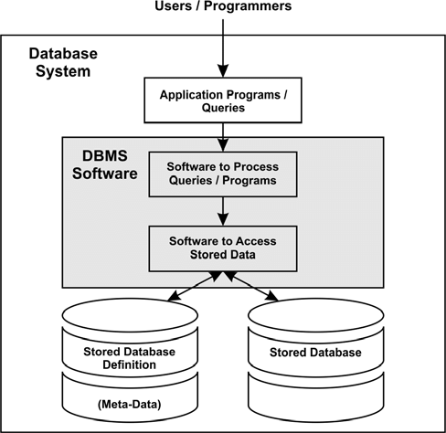

### MiniDB - An SQLite Clone implemented entirely in C ###

This is my effort to learn and understand the workings of a database system under the hood, as I have a DBMS course in my semester and I wished to know how to implement the theoretical concepts that I learnt in code.

